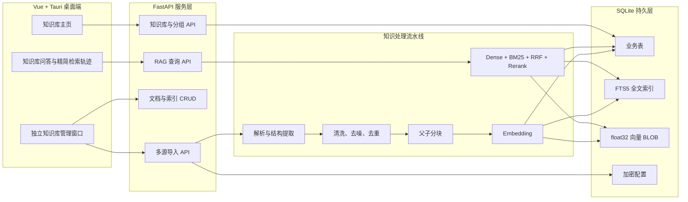
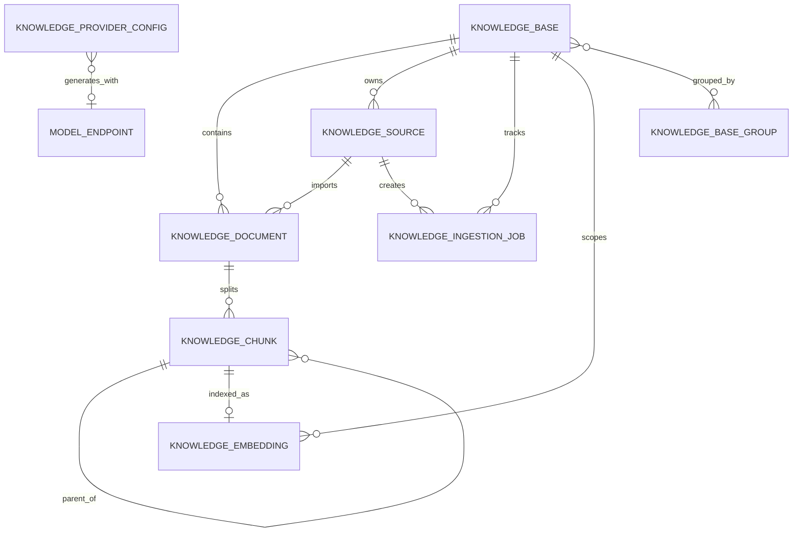
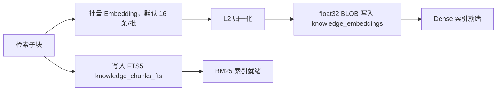
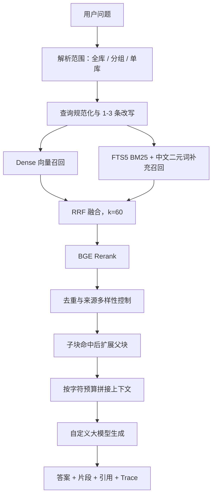

# EvoAgent 知识库模块完整技术设计与工作流程

> 实现基线：`knowledgeSet` 分支，提交 `ce03ee1` 及后续兼容提交  
> 适用范围：EvoAgent Windows 桌面端学科知识库、Agent 知识检索和 RAG 问答  
> 相关接口明细：[KNOWLEDGE_API.md](KNOWLEDGE_API.md)

## 1. 建设目标

知识库模块面向一流学科建设场景，目标不是简单的“文件上传与搜索”，而是建立一条可管理、可追溯、可评测的学科知识生产链：

1. 支持文件、网页、数据库、API/第三方平台等多源数据。
2. 对原始数据执行解析、清洗、去噪、去重和结构化父子切分。
3. 使用可配置 Embedding 模型生成向量，并在本地 SQLite 中保存向量、全文索引和来源元数据。
4. 支持全库、分组和单知识库三种检索范围。
5. 对用户问题执行查询改写、Dense/BM25 混合召回、RRF 融合、Rerank、父块扩展和上下文拼接。
6. 使用自定义大模型接口生成带证据引用的回答；模型不可用时仍可降级运行。
7. 在桌面端提供知识库、文档、分块、向量和数据源的可视化增删改查。
8. 为 Agent、工作流和 MCP 提供统一知识检索接口。

## 2. 总体架构



### 2.1 技术栈

| 层级 | 技术 | 作用 |
|---|---|---|
| 桌面容器 | Tauri 2 / Rust | Windows 窗口、独立知识库窗口、后端 sidecar 生命周期 |
| 前端 | Vue 3 / TypeScript / Vite | 知识库创建、分组、问答、内容与索引管理 |
| 后端 | Python / FastAPI / SQLAlchemy Async | 数据接入、处理、检索、生成和 API |
| 主数据库 | SQLite + WAL | 本地持久化、事务、桌面端便携部署 |
| 全文检索 | SQLite FTS5 | BM25 关键词召回 |
| 向量存储 | SQLite `float32` BLOB | 单机可移植的 Dense 向量检索 |
| Embedding | `Qwen/Qwen3-VL-Embedding-8B` | 默认通过 SiliconFlow 兼容接口调用 |
| Rerank | `BAAI/bge-reranker-v2-m3` | 对融合候选进行相关性重排 |
| 生成模型 | 自定义 OpenAI 兼容端点 | 查询改写与带引用答案生成 |

## 3. 核心代码结构

```text
backend/app/
├── api.py                              # 知识库 REST API
├── models.py                           # SQLAlchemy 数据模型
├── schemas.py                          # 请求校验模型
├── db.py                               # SQLite 异步会话、WAL 和增量迁移
└── services/
    ├── knowledge.py                    # 文档入库、混合检索、RAG 生成
    ├── knowledge_processing.py         # 文件解析、清洗和父子分块
    ├── knowledge_sources.py            # 网页、数据库、API 数据源
    ├── knowledge_vector.py             # Embedding、Rerank 和向量存储
    └── secrets.py                      # 本地密钥与 Fernet 加密

frontend/src/
├── views/KnowledgeView.vue             # 知识库主页、分组、创建、问答
├── views/KnowledgeDetailView.vue       # 独立管理窗口与内部 CRUD
├── services/api.ts                     # 前端 HTTP 客户端
└── router.ts                           # /knowledge 与 /knowledge/:id
```

## 4. 数据模型与关系



### 4.1 主要表

| 表 | 关键字段 | 用途 |
|---|---|---|
| `knowledge_bases` | `name`、`discipline`、`document_count` | 知识库主体 |
| `knowledge_base_groups` | `name`、`color` | 知识库逻辑分组 |
| `knowledge_base_group_members` | `group_id`、`knowledge_base_id` | 分组与知识库多对多关系 |
| `knowledge_documents` | `source_id`、`content_hash`、`cleaning_stats_json` | 清洗后的文档记录与去重依据 |
| `knowledge_chunks` | `level`、`parent_chunk_id`、`content_hash`、`metadata_json` | 父块/子块、页码或章节定位、引用信息 |
| `knowledge_sources` | `source_type`、`uri`、`config_ciphertext`、`status` | 文件、网页、数据库、API 连接 |
| `knowledge_ingestion_jobs` | `stage`、`progress`、`duplicate_count`、`error` | 数据源同步状态与错误追踪 |
| `knowledge_embeddings` | `provider`、`model`、`dimensions`、`vector` | 子块归一化向量及模型版本 |
| `knowledge_provider_configs` | 模型 URL、模型名、Top-K、候选数、上下文预算 | RAG 全局配置 |

### 4.2 分组策略

- 一个知识库可以属于多个分组。
- 分组只控制组织方式和检索范围，不复制文档、分块或向量。
- 删除分组仅删除关系，不删除知识库内容。
- 同时传入知识库 ID 与分组 ID 时，后端取两者解析结果的并集。
- 明确指定空分组时返回空结果，不会意外退化为全库搜索。

## 5. 知识库完整建立流程

### 5.1 第一步：配置模型

在“知识库模型配置”中设置：

- Embedding URL：`https://api.siliconflow.cn/v1/embeddings`
- Embedding 模型：`Qwen/Qwen3-VL-Embedding-8B`
- Rerank URL：`https://api.siliconflow.cn/v1/rerank`
- Rerank 模型：`BAAI/bge-reranker-v2-m3`
- SiliconFlow API Key：通过界面加密保存，或使用环境变量 `EVO_SILICONFLOW_API_KEY`
- 答案生成模型：选择“自定义大模型 API”中已经配置的模型端点
- 默认候选数：30
- 默认最终 Top-K：6
- 默认上下文预算：12000 字符

API Key 不写入 Git，也不通过配置查询接口返回。没有 API Key 时，系统使用确定性的本地 Hash Embedding 和词项 Rerank 作为可演示降级模式；正式评测应确认 Provider 显示为 `siliconflow`。

### 5.2 第二步：创建知识库与分组

用户可以先创建分组，也可以直接创建知识库。创建知识库需要填写名称、学科和说明，并可在创建过程中选择一种初始数据：

- 暂不添加；
- 一个或多个 PDF、DOCX、PPTX 等文件，或递归导入整个文件夹；
- 网页 URL；
- 数据库连接与只读查询；
- API/第三方数据接口。

创建成功后，桌面端自动打开 `knowledge-{id}` 独立窗口。浏览器模式使用新标签页作为兼容回退。

### 5.3 第三步：多源数据接入

#### 文件

桌面端既支持多选文件，也支持选择整个文件夹。文件夹导入会递归枚举子目录，过滤不支持的格式，并把相对路径（例如 `课程资料/第一章/讲义.pdf`）写入文档标题、来源与元数据。导入任务顺序执行解析、清洗、去重、分块、向量化和 SQLite 写入；界面实时显示进度及新增、重复、失败、跳过统计。相同内容再次导入时复用已有文档并清理临时数据源记录。

| 格式 | 解析策略 |
|---|---|
| PDF | 按页抽取，保存页码定位 |
| DOCX | 保留标题层次，附加表格内容 |
| PPTX | 按幻灯片抽取文本和表格，保存页号 |
| TXT / Markdown | UTF-8 文本解析 |
| CSV | 转换为管道分隔的结构化行 |
| JSON | 作为文本内容进入清洗流水线 |
| HTML | 移除脚本、样式、导航、页眉页脚和表单 |

单文件上限为 25 MB。旧格式 `.doc` 和 `.ppt` 需要先另存为 `.docx` 和 `.pptx`。

#### 网页

- 仅允许公网 HTTP/HTTPS 地址。
- 拒绝 localhost、回环、内网、链路本地和保留地址，降低 SSRF 风险。
- 默认限制在起始站点同域抓取。
- 单数据源最多抓取 20 页。
- 提取标题、正文和可继续访问的链接，去除导航与可执行内容。

#### 数据库

- 连接配置加密保存。
- 仅接受以 `SELECT` 或 `WITH` 开头的只读查询。
- 默认最多读取 5000 行，硬限制 20000 行。
- SQLite 可直接使用；PostgreSQL、MySQL 等需要在运行环境安装对应 SQLAlchemy 驱动。
- 查询结果按结构化行转换为可索引文本。

#### API / 第三方平台

- 支持 GET 和 POST。
- 请求头、参数与请求体加密保存。
- 支持 `data.items.0` 形式的 JSON 路径抽取。
- 响应体大小受限，并使用与网页相同的公网地址安全校验。

### 5.4 第四步：清洗与文档级去重

清洗顺序如下：

1. 使用 Unicode NFKC 规范化字符。
2. 将不间断空格转换为普通空格。
3. 删除控制字符。
4. 压缩行内多余空白。
5. 删除纯分隔符、孤立页码等噪声行。
6. 对重复三次以上的短页眉/页脚仅保留一次。
7. 合并连续空行。
8. 对清洗后全文计算 SHA-256。
9. 在同一知识库内按全文 Hash 去重。

清洗结果保存 `original_chars`、`cleaned_chars`、`noise_lines_removed`、`repeated_lines_removed` 和 `duplicate_chunks_removed`，可在独立管理窗口中检查。

### 5.5 第五步：结构感知父子分块

当前实现使用“结构信息 + 句子边界 + 父子块”的方案：

| 参数 | 默认值 | 作用 |
|---|---:|---|
| 父块目标长度 | 1600 字符 | 为答案生成保留较完整上下文 |
| 子块目标长度 | 480 字符 | 提高细粒度召回精度 |
| 子块重叠 | 80 字符 | 避免语义在边界处断裂 |

处理规则：

1. PDF 页、Word 章节、PPT 幻灯片等结构先转换为 `ExtractedSection`。
2. 在句号、问号、换行等边界上切分语义单元。
3. 识别 `1.`、`（1）`、`一、`、`①` 等连续编号列表，将列表标题和全部条目保存为同一个列表父块。
4. 列表中的每一点独立生成可检索子块，并保存 `list_id`、条目序号、条目总数和原始编号。
5. 普通语义单元按目标长度组装为父块，再在父块内部生成带重叠的检索子块。
6. 子块保存父块 ID、页码/章节/幻灯片等定位元数据。
7. 对规范化后的子块计算 Hash，删除重复子块。
8. 只对检索子块生成向量；父块用于命中后的上下文扩展。命中列表任意一点时，生成上下文会展开完整列表父块。

该设计兼顾两类目标：子块负责“找得准”，父块负责“回答完整”。

### 5.6 第六步：向量化与双索引写入



向量表同时记录 Provider、模型名、维度、原文 Hash 和创建时间。这能区分不同模型生成的索引，并支持模型切换后的全量重新向量化。

SQLite 向量检索会读取目标范围内的向量并计算归一化点积，即余弦相似度。该策略不依赖 Windows 原生向量扩展，部署简单、可离线迁移，适合桌面端中小规模学科库。若未来达到百万级子块，应迁移到 SQLite 向量扩展、Qdrant、Milvus 或 PostgreSQL/pgvector，并保持现有服务接口不变。

## 6. 知识库问答完整工作流程



### 6.1 查询改写

- 有可用生成模型端点时，大模型在保留专有名词和原意的前提下输出 1 至 3 条互补检索式。
- 模型不可用时，使用规范化原问题和确定性关键词抽取作为回退。
- 原问题始终保留，避免改写偏离用户意图。

### 6.2 Dense 召回

1. 对每条改写查询生成 Embedding。
2. 在解析后的知识库范围内计算余弦相似度。
3. 每路最多保留 `candidate_k` 个候选。
4. 同一子块在多条改写中取最高 Dense 分数。

### 6.3 关键词召回

- 使用 FTS5/BM25 对技术术语、公式符号、英文缩写和精确名称进行召回。
- 由于不同 SQLite 构建的 `unicode61` 对中文专业词切分可能不一致，系统额外计算英文词项和中文二元词覆盖率。
- 两种关键词结果合并，降低中文专名漏召回风险。

### 6.4 RRF 融合

Dense 与关键词排名使用 Reciprocal Rank Fusion 合并：

```text
RRF(chunk) = Σ 1 / (60 + rank_i)
```

RRF 不要求不同召回器的原始分数处于相同量纲，适合融合余弦相似度和 BM25 排名。

### 6.5 Rerank 与多样性控制

融合后的候选交给 `BAAI/bge-reranker-v2-m3` 重排。若在线 Rerank 失败，后端保留错误信息并退化为 RRF 分数排序。

最终选择还执行：

- 相同内容 Hash 去重；
- 同一父块只占用一个 Top-K 名额，避免重复上下文挤占候选；
- 多文档普通查询默认每篇最多保留 3 个不同父块；当候选仅来自一篇文档，或查询包含“全部、五点、逐条、完整列出”等完整性意图时，上限自动放宽到 `top_k`；
- 最终数量不超过 `top_k`；
- 子块用于命中评分，父块用于生成上下文；编号列表会记录完整展开的列表数和条目数。

### 6.6 上下文与引用生成

每条证据格式为：

```text
[资料 N] 文档标题，页码/章节/幻灯片，来源：原始来源
父块或子块正文
```

系统按 `context_char_budget` 去重、排序和截断。生成模型被要求：

1. 只能依据给定资料回答；
2. 无法确认时明确说明证据不足；
3. 关键结论后使用 `[资料 N]`；
4. 不得编造引用。

响应同时返回 `chunks`、`citations` 和 `trace`，前端因此能够展示可核对证据和精简检索过程。

### 6.7 前端精简检索轨迹

主页通过 SSE 接收真实后端阶段事件，按顺序显式显示五个必要阶段，避免用前端定时动画模拟检索进度：

1. **确认检索范围**：解析全库、分组或单知识库范围；
2. **查询改写**：显示实际使用的互补检索式；
3. **混合召回与融合**：显示 Dense、BM25 和 RRF 融合候选数量；
4. **相关性重排**：显示重排候选数与最终保留片段数；
5. **组织证据与回答**：显示上下文字符数、答案字符数和引用数量。

完整正文、分块、向量模型和数据源状态位于知识库独立管理窗口，不再堆叠在知识库主页。

## 7. 前端用户工作流

### 7.1 知识库主页

1. 创建和编辑知识库分组。
2. 查看知识库卡片及其学科、文档数和所属分组。
3. 在卡片上移动/调整所属分组，或通过二次确认永久删除知识库。
4. 创建知识库并导入初始数据。
5. 配置 Embedding、Rerank 和生成模型。
6. 选择全库、分组或当前知识库执行问答。
7. 查看五步实时检索过程、答案和引用片段。

### 7.2 独立管理窗口

点击知识库卡片后打开独立窗口，包含：

- **文档管理**：多文件上传、整个文件夹递归导入、实时导入统计、文字录入、文档选择与删除；
- **正文编辑**：查看清洗正文，修改标题、来源和全文；
- **分块索引**：查看父块、子块、定位、Token 估算、Hash、模型和维度；
- **数据源**：新增网页/数据库/API，编辑连接、同步和删除；
- **检索策略**：查看候选数、Top-K、Rerank、上下文预算和向量实例；
- **知识库设置**：修改名称、学科、说明或删除整个知识库。

修改正文时，后端删除旧文档的 FTS、分块和向量，再以新内容重新执行完整流水线。响应可能返回新的文档 ID，前端会自动切换到重建后的记录。

## 8. API 分层

### 8.1 配置

- `GET /api/knowledge/config`
- `PUT /api/knowledge/config`
- `POST /api/knowledge/config/test`

### 8.2 知识库与分组

- `GET|POST /api/knowledge-bases`
- `PATCH|DELETE /api/knowledge-bases/{knowledge_base_id}`
- `GET|POST /api/knowledge-groups`
- `PATCH|DELETE /api/knowledge-groups/{group_id}`
- `PUT /api/knowledge-groups/{group_id}/members`

### 8.3 文档与内部索引

- `GET /api/knowledge-bases/{knowledge_base_id}/documents`
- `POST /api/knowledge-bases/{knowledge_base_id}/documents/upload`
- `POST /api/knowledge-bases/{knowledge_base_id}/documents/text`
- `GET|PATCH|DELETE /api/knowledge-documents/{document_id}`
- `GET /api/knowledge-documents/{document_id}/chunks`
- `GET /api/knowledge-bases/{knowledge_base_id}/overview`
- `POST /api/knowledge-bases/{knowledge_base_id}/reindex`

### 8.4 数据源

- `GET /api/knowledge-bases/{knowledge_base_id}/sources`
- `POST /api/knowledge-bases/{knowledge_base_id}/sources/web`
- `POST /api/knowledge-bases/{knowledge_base_id}/sources/database`
- `POST /api/knowledge-bases/{knowledge_base_id}/sources/api`
- `PATCH|DELETE /api/knowledge-sources/{source_id}`
- `POST /api/knowledge-sources/{source_id}/sync`
- `GET /api/knowledge-ingestion-jobs/{job_id}`

### 8.5 检索与生成

- `POST /api/knowledge/search`：兼容片段检索接口；
- `POST /api/knowledge/query`：查询改写、混合检索、Rerank、生成和 Trace 完整接口；
- `POST /api/knowledge/query/stream`：以 SSE 逐步返回检索阶段事件和最终结果。

详细请求和响应示例见 [KNOWLEDGE_API.md](KNOWLEDGE_API.md)。

## 9. CRUD 与事务一致性

- 删除文档时同步删除 FTS5 行、父子块和向量，并更新知识库文档数。
- 删除数据源时可以选择保留已经导入的文档，或同时删除文档与索引。
- 删除知识库时级联清理文档、分块、向量、FTS、数据源、任务和分组关系。
- 修改正文采用“删除旧索引 + 全量重建”而不是局部覆盖，避免旧向量残留。
- 知识库写接口在返回 HTTP 响应前显式提交事务，避免桌面端保存后立即刷新时出现“接口成功但下一次读取尚不可见”的竞态。
- SQLite 使用 WAL、外键约束和 15 秒忙等待，提高桌面端并发读写稳定性。

## 10. 安全设计

1. API Key、请求头、数据库连接和第三方凭据使用 Fernet 加密后保存到 SQLite。
2. 加密密钥保存在本机数据目录，不进入 Git。
3. 配置查询接口只返回 `has_api_key`，不返回密钥明文或密文。
4. 网页和 API 接入阻止内网、回环、链路本地和保留地址。
5. 数据库查询只允许只读 SQL，并限制最大行数。
6. 文件大小、网页数量和远程响应大小均有限制。
7. Tauri 权限仅开放给 `main` 和 `knowledge-*` 窗口，并只授权必要的窗口创建和后端启动能力。
8. 错误信息在返回前会对敏感连接信息脱敏。

## 11. 持久化与部署

### 11.1 开发模式

默认数据库：

```text
<项目根目录>/data/evoagent.db
```

启动：

```powershell
cd "D:\100_usingPlace\【科大讯飞】2026揭榜挂帅\EvoAgent-Next"
.\start-dev.bat
```

### 11.2 打包桌面模式

打包程序使用：

```text
%LOCALAPPDATA%\EvoAgent\evoagent.db
%LOCALAPPDATA%\EvoAgent\.secret.key
%LOCALAPPDATA%\EvoAgent\workspace\
```

桌面 EXE 启动时由 Tauri 自动拉起 `evoagent-backend.exe` sidecar，并在退出时终止对应子进程。

完整构建：

```powershell
cd "D:\100_usingPlace\【科大讯飞】2026揭榜挂帅\EvoAgent-Next"
powershell -ExecutionPolicy Bypass -File .\scripts\build_desktop.ps1
```

输出位置：

```text
frontend/src-tauri/target/release/evoagent-desktop.exe
frontend/src-tauri/target/release/bundle/nsis/EvoAgent_0.1.0_x64-setup.exe
frontend/src-tauri/target/release/bundle/msi/EvoAgent_0.1.0_x64_en-US.msi
```

## 12. 测试体系

### 12.1 自动化覆盖

`backend/tests/test_knowledge_rag.py` 覆盖：

- 文本清洗和父子切分；
- PPTX 结构提取；
- 模型配置安全与默认值；
- 文本入库、向量生成、检索、引用和问答；
- 文档去重；
- 数据库数据源完整同步；
- 网页/API/数据库数据源注册；
- 分组 CRUD 和范围检索；
- 知识库、文档、数据源 CRUD 与索引重建；
- SiliconFlow Embedding 和 Rerank 请求协议。

运行：

```powershell
.\.venv\Scripts\python.exe -m pytest -q
.\.venv\Scripts\python.exe -m ruff check backend/app backend/tests
cd frontend
npm run build
cd src-tauri
cargo check
```

自动化测试还覆盖文件夹相对路径保留和重复文件数据源清理。每次发布以实际测试命令输出为准，Ruff、Vue/TypeScript 生产构建和 Rust/Tauri 编译均必须通过。

### 12.2 人工验收

建议使用包含唯一识别码的可控文档，依次验证：

1. 上传后正文无乱码；
2. 父块、子块和向量数量大于零；
3. Provider 为预期的 `siliconflow`；
4. 精确关键词能够命中；
5. 语义改写问题能够命中；
6. 不存在的信息不会被编造；
7. 回答引用能够定位到正确文档和页码/章节；
8. 修改正文后新内容可检索、旧内容不再命中；
9. 删除文档后没有残留检索结果；
10. 重启桌面端后数据仍然存在。

## 13. 运行状态判定与排错

| 现象 | 检查位置 | 处理建议 |
|---|---|---|
| `Not Found` | 后端是否为当前版本、OpenAPI 是否存在目标路径 | 重新启动或替换最新 sidecar |
| Provider 为 `local-hash-fallback` | 模型配置中的 API Key | 配置 SiliconFlow Key 并测试连接 |
| 文档有内容但向量为 0 | 数据源任务错误、Embedding 请求 | 查看独立窗口“数据源”和任务错误，重新向量化 |
| 中文专业词召回不稳定 | 精简检索轨迹中的 Dense/BM25 数量 | 检查 Embedding 模型，保留关键词补充召回 |
| 回答正确但缺引用 | 生成端点提示词或返回内容 | 检查 `citations` 和上下文，验证生成模型遵循 `[资料 N]` |
| 修改后短暂查不到 | API 版本与事务提交 | 确认使用包含显式提交修复的当前版本 |
| 网页/API 无法接入 | URL 是否为内网、响应大小、证书或 JSON 路径 | 使用公网 HTTPS 地址并检查同步错误 |
| 数据库无法连接 | 驱动、连接串、SQL 是否只读 | 安装驱动并使用 `SELECT`/`WITH` 查询 |

## 14. 当前方案边界与演进建议

### 当前适合

- 单机 Windows 桌面软件；
- 学科团队或个人知识工作台；
- 中小规模文档集合；
- 强调离线可用、便携、审计和来源追溯的揭榜挂帅演示与实际应用。

### 后续演进

1. 大规模语料下将 Dense 检索替换为 ANN 向量索引。
2. 对扫描 PDF 增加 OCR、版面分析、公式和图表多模态抽取。
3. 增加异步任务队列、暂停/恢复、增量同步和定时同步。
4. 增加检索评测集、Recall@K、MRR、nDCG、答案忠实度和引用正确率面板。
5. 为 Agent 工厂暴露知识库检索工具，让 Agent 按权限选择全库、分组或单库。
6. 对敏感学科资料增加用户、角色、知识库级 ACL 和审计导出。
7. 对 Embedding 模型变更增加双索引灰度迁移，减少全量重建期间的不可用时间。

## 15. 一条完整数据链总结

```text
创建知识库/分组
  → 接入文件、网页、数据库或 API
  → 提取页码、章节、幻灯片和来源结构
  → Unicode 规范化、去噪、去重
  → 1600 字符父块 + 480 字符子块 + 80 字符重叠
  → 子块 Embedding
  → SQLite float32 向量 + FTS5 双索引
  → 用户选择全库/分组/单库提问
  → 查询改写
  → Dense 与 BM25 并行召回
  → RRF 融合
  → BGE Rerank
  → 内容去重与来源多样性控制
  → 父块上下文扩展
  → 字符预算拼接
  → 自定义大模型生成带 [资料 N] 引用的答案
  → 前端展示精简检索轨迹、答案和原始证据
```

该链路形成了 EvoAgent 知识库模块从“数据进入”到“可靠回答”、从“可视化管理”到“Agent 调用”的完整技术闭环。
